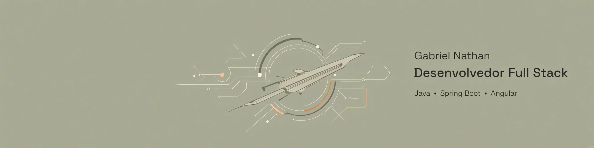

  

## Sobre Mim

Sou Desenvolvedor Full Stack com experiência prática no desenvolvimento de aplicações web, atuando em back-end e front-end com foco em Java, Spring Boot, Angular, APIs REST e SQL.

Tenho experiência em desenvolvimento de APIs REST, modelagem de dados, implementação de regras de negócio e integração entre sistemas, aplicando boas práticas de arquitetura e organização de código.

Minha experiência vem de projetos pessoais, acadêmicos e open source, com participação em code reviews e desenvolvimento colaborativo. Utilizo Git e GitHub para versionamento e acompanhamento dos projetos, com atenção à qualidade e organização do código.

Atualmente, curso Bacharelado em Sistemas de Informação na Universidade Veiga de Almeida e busco oportunidades na área de Desenvolvimento de Software, especialmente em posições Full Stack com Java e tecnologias relacionadas.
